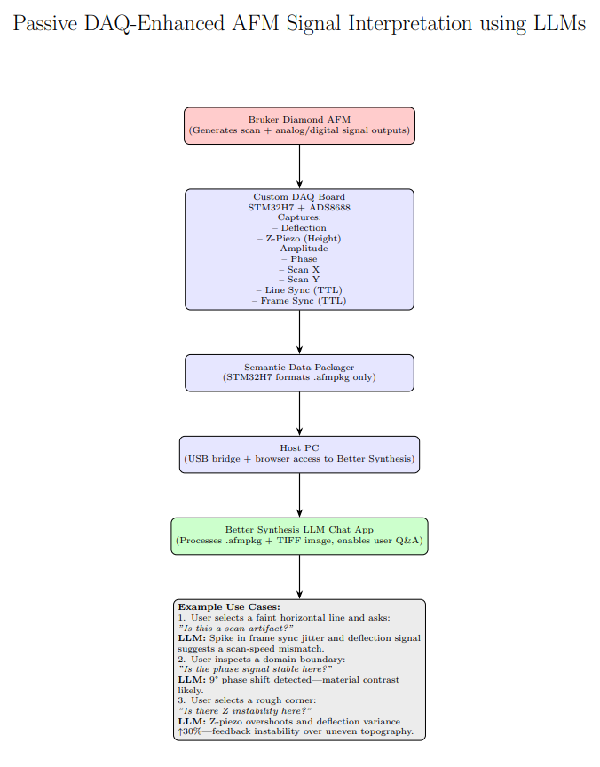
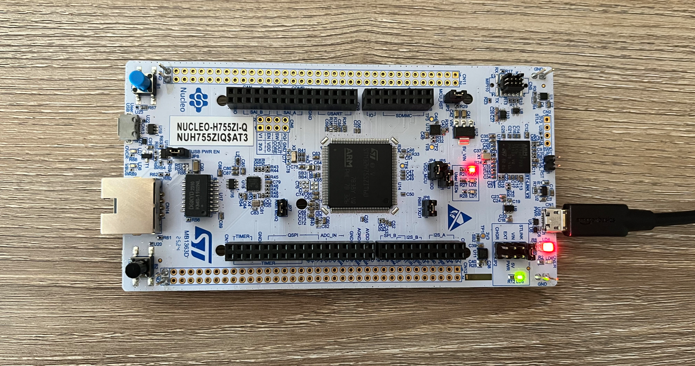

# CHM392
Repository for CHM392: Introduction to Research Techniques

# Passive AFM Signal Capture and LLM-Based Analysis

## Overview

This project demonstrates a proof-of-concept system for **passive signal capture** from an atomic force microscope (AFM), using an STM32H755ZI Nucleo-144 development board. The system is designed to record multiple analog and digital signals, such as cantilever deflection, Z-piezo motion, and scan sync pulses—and package them into a structured `.afmpkg` format.

Each `.afmpkg` file is time-synchronized with the microscope’s scanning parameters and is intended to be processed by a **large language model (LLM)** via the Better Synthesis platform. This enables high-level interpretation and automated troubleshooting of nanoscale scan data, significantly reducing manual diagnostic work.

## Key Features

- **Hardware**: STM32H7-based DAQ with GPIO and ADC support for analog + digital acquisition
- **Signal Support**: Deflection, Z-height, amplitude, phase, scan X/Y, line and frame sync
- **Data Packaging**: Custom `.afmpkg` JSON-style format with timestamp-pixel alignment
- **AI Integration**: LLM-ready structure with event logs, prompts, and context tagging
- **Test Support**: Signal generator compatibility for DAQ validation and mock scans

## Use Cases

- Real-time or retrospective scan artifact detection
- Intelligent diagnostic feedback during surface metrology
- Autonomous monitoring of probe engagement and synchronization faults
- Data-driven training of microscopy workflows using LLM-inferred features

## Getting Started

1. Connect your AFM signal outputs (or use a signal generator for testing)
2. Wire analog/digital lines to the Nucleo board (use BNC breakout or adapters)
3. Run the DAQ firmware to log data into `.afmpkg` format
4. Upload `.afmpkg` and corresponding TIFF scan to Better Synthesis platform
5. Interact via LLM prompt for troubleshooting, interpretation, or summary

## Pinout and Signal Reference

The following table defines the signal assignments between the AFM test setup and the STM32H755ZI Nucleo board. This setup supports analog and digital acquisition for packaging into `.afmpkg` format:

| Signal Name   | Type     | STM32 Pin (CN11/CN12) | Description                                                                 |
|---------------|----------|------------------------|-----------------------------------------------------------------------------|
| `deflection`  | Analog   | `PA0` (AIN0)           | Cantilever deflection voltage from AFM head (mechanical response)          |
| `z_piezo`     | Analog   | `PA1` (AIN1)           | Voltage controlling Z-axis piezo position (sample height feedback)         |
| `amplitude`   | Analog   | `PA2` (AIN2)           | Vibration amplitude in tapping/non-contact modes                           |
| `phase`       | Analog   | `PA3` (AIN3)           | Phase lag between drive signal and cantilever response                     |
| `scan_x`      | Analog   | `PA4` (AIN4)           | X-axis scan ramp signal (fast axis, triangle waveform)                     |
| `scan_y`      | Analog   | `PA5` (AIN5)           | Y-axis scan ramp signal (slow axis, stepped ramp)                          |
| `line_sync`   | Digital  | `PB0` (DIN0)           | TTL signal generated at start of each scan line                            |
| `frame_sync`  | Digital  | `PB1` (DIN1)           | TTL pulse generated at start of each full image frame                      |
| `timestamp`   | Internal | N/A                    | Internal timer used to align all signals and pixel positions               |
| `scan_image`  | External | TIFF Upload            | AFM-acquired scan image (loaded externally, synchronized post-capture)     |

Signals are sampled at 10 kHz (analog, 12-bit resolution) and latched (digital) with sub-millisecond precision. Each data stream is timestamped and packaged into `.afmpkg` files for LLM-based interpretation.

# Initial Boot

